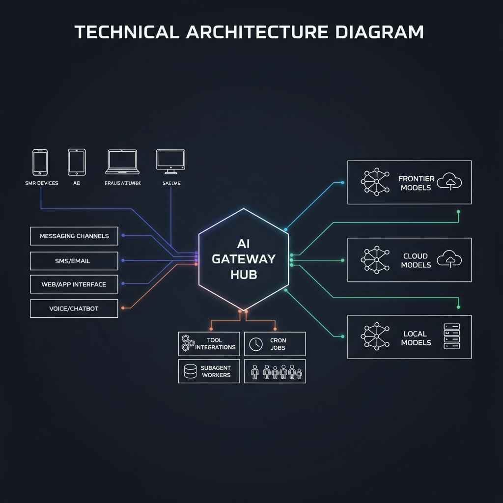

<p align="center">
  <h1 align="center">Fork My Stack</h1>
  <p align="center"><strong>My entire AI assistant setup. Yours in an afternoon.</strong></p>
</p>

<p align="center">
  <a href="LICENSE"></a>
  
  
  
</p>

<p align="center">
  <a href="#-quick-start">Quick Start</a> •
  <a href="#-architecture">Architecture</a> •
  <a href="#-guides">Guides</a> •
  <a href="#-cost-breakdown">Cost</a> •
  <a href="#-blog-posts">Blog</a>
</p>


---

## 🚀 What This Is

`fork-my-stack` is my production-style starter stack for running a personal AI assistant with real workflows, real memory, and real automation.

### You get:
- **Channel-ready assistant patterns** (WhatsApp, Telegram, Slack, Discord)
- **Multi-model routing** (frontier + coding + local Ollama)
- **Cron automations** for recurring tasks
- **MCP integrations** for external systems/tools
- **Structured memory system** (daily + long-term)
- **Sub-agent execution model** for isolated project work

---

## ⚡ Quick Start

```bash
# 1) Clone
cd ~/Development
git clone https://github.com/YOUR_USERNAME/fork-my-stack.git
cd fork-my-stack

# 2) Copy workspace scaffold
mkdir -p ~/.openclaw/workspace
cp -R workspace/* ~/.openclaw/workspace/

# 3) Create gateway config from template
mkdir -p ~/.openclaw/config
cp config/gateway-template.yaml ~/.openclaw/config/gateway.yaml

# 4) Edit config (models, channels, MCP servers, keys)
$EDITOR ~/.openclaw/config/gateway.yaml

# 5) Start OpenClaw
openclaw gateway start
openclaw gateway status

# 6) Validate
openclaw help
```

If using local inference, set up Ollama via [`guides/ollama-setup.md`](guides/ollama-setup.md).

---

## 🧠 Architecture



```text
You (any device) → Channels (WhatsApp/Telegram/Slack/Discord) → OpenClaw Gateway → Agent Loop
                                                                        ↓
                                                    ┌─────────────────────────────────┐
                                                    │  Frontier Model (Opus/GPT-4)    │
                                                    │  Coding Model (Codex)           │
                                                    │  Local Model (Ollama, $0)       │
                                                    └─────────────────────────────────┘
                                                                        ↓
                                                    MCP Tools │ Cron Jobs │ Memory │ Sub-agents
```

---

## 📦 What's Inside

| Path | Type | Purpose |
|---|---|---|
| `README.md` | File | Main setup + architecture + docs index |
| `LICENSE` | File | MIT license |
| `.gitignore` | File | Git ignore rules |
| `assets/` | Directory | README images (banner + architecture) |
| `config/` | Directory | OpenClaw gateway config templates |
| `config/gateway-template.yaml` | File | Starter gateway config |
| `workspace/` | Directory | Assistant identity, memory, and operating docs |
| `workspace/AGENTS.md` | File | Global operating rules and routing policy |
| `workspace/SOUL.md` | File | Assistant personality and behavior profile |
| `workspace/USER.md` | File | User-specific preferences/context |
| `workspace/TOOLS.md` | File | Environment/tool notes |
| `workspace/MEMORY.md` | File | Long-term curated memory |
| `workspace/HEARTBEAT.md` | File | Periodic check instructions |
| `workspace/memory/` | Directory | Daily memory/log files |
| `guides/` | Directory | Practical setup and strategy docs |
| `guides/ollama-setup.md` | File | Local model setup |
| `guides/multi-model-routing.md` | File | Model routing strategy |
| `guides/mcp-servers.md` | File | MCP server catalog |
| `guides/blog-automation.md` | File | Content automation workflows |
| `crons/` | Directory | Scheduled automation job examples |
| `crons/channel-monitor.json` | File | Channel monitoring automation |
| `crons/weekly-build-log.json` | File | Weekly build-log automation |
| `crons/daily-content-pitches.json` | File | Daily idea/content automation |
| `crons/memory-maintenance.json` | File | Memory upkeep automation |

---

## 💸 Cost Breakdown

| Component | Free Tier / Self-Hosted | Paid Option |
|---|---|---|
| OpenClaw runtime | ✅ Run locally | Optional hosted infra |
| Ollama local model | ✅ $0/token on your hardware | GPU cloud if you outsource |
| Frontier model (Opus / GPT-4) | ❌ | API usage based |
| Coding model (Codex-family) | ❌ | API usage based |
| Messaging channels | ⚠️ Some free/dev tiers | Provider/API pricing |
| MCP servers | ✅ Self-host OSS servers | Managed services / external APIs |

**Rule of thumb:** use frontier models for quality-critical work, coding models for implementation, and Ollama for low-cost recurring jobs.

---

## 🔌 MCP Servers (11)

| Server | Repo |
|---|---|
| `mcp-proxmox-admin` | <https://github.com/EricGrill/mcp-proxmox-admin> |
| `mcp-kali-orchestration` | <https://github.com/EricGrill/mcp-kali-orchestration> |
| `mcp-bitcoin-cli` | <https://github.com/EricGrill/mcp-bitcoin-cli> |
| `mcp-multi-agent-ssh` | <https://github.com/EricGrill/mcp-multi-agent-ssh> |
| `mcp-multi-agent-server-delegation` | <https://github.com/EricGrill/mcp-multi-agent-server-delegation> |
| `mcp-predictive-market` | <https://github.com/EricGrill/mcp-predictive-market> |
| `mcp-civic-data` | <https://github.com/EricGrill/mcp-civic-data> |
| `mcp-memvid-state-service` | <https://github.com/EricGrill/mcp-memvid-state-service> |
| `mcp-market-data` | <https://github.com/EricGrill/mcp-market-data> |
| `mcp-ipfs` | <https://github.com/EricGrill/mcp-ipfs> |
| `quickbooks-online-mcp-server` | <https://github.com/EricGrill/quickbooks-online-mcp-server> |

---

## 📚 Guides

- [Ollama Setup](guides/ollama-setup.md)
- [Multi-Model Routing](guides/multi-model-routing.md)
- [MCP Servers](guides/mcp-servers.md)
- [Blog Automation](guides/blog-automation.md)

---

## ✍️ Blog Posts

Related reading from ericgrill.com:

- [Run Your AI Assistant on a Local GPU for (Basically) Free](https://ericgrill.com/blog/local-gpu-ai-assistant-free)
- [Claude Code Agents](https://ericgrill.com/blog/claude-code-agents)
- [Claude Code Hooks](https://ericgrill.com/blog/claude-code-hooks)
- [Claude Code Skills](https://ericgrill.com/blog/claude-code-skills)
- [Proxmox Cluster Rescue with Claude Code](https://ericgrill.com/blog/claude-code-proxmox-cluster-rescue)
- [QuickBooks MCP: AI Bookkeeper](https://ericgrill.com/blog/quickbooks-mcp-ai-bookkeeper)
- [Memvid: Portable AI Memory](https://ericgrill.com/blog/memvid-portable-ai-memory)

---

## 👋 About

Built by **Eric Grill** — **Builder | Breaker | Fixer**.

- Website: <https://ericgrill.com>
- GitHub: <https://github.com/EricGrill>
- X/Twitter: <https://x.com/EricGrill>

If this helped you, fork it, customize it, and ship your own assistant stack.
